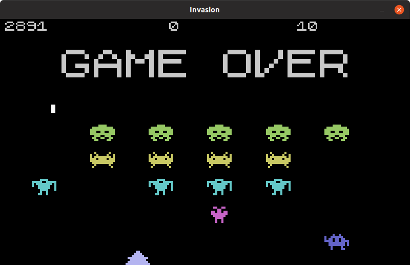
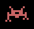

# MArcade - Invasion
Invasion Márcio's Arcade games

Based on memorable Space Invaders

## Screenshot


## Videos
Watch on [YouTube].

## Running
To start game:
``` bash
./marcade.py invasion
```

## Characters

### Bublebulb

- Name: Bublebulb
- Points: 10

### Craby

- Name: Craby
- Points: 9

### ThreeNeeTee

- Name: ThreeNeeTee
- Points: 8

### Pobah

- Name: Pobah
- Points: 7

### Androeed

- Name: Androeed
- Points: 6

### Raken

- Name: Raken
- Points: 5

## Contributors

### Developers
- [Márcio Pessoa](https://github.com/marcio-pessoa)

### Designers
- Nícolas Masaishi Oi Pessoa <masaishi.pessoa@gmail.com>
- Gustavo Nuzzo Gass <gustavonuzzogass@gmail.com>
- [Márcio Pessoa](https://github.com/marcio-pessoa)

### Beta testers
- Gustavo Nuzzo Gass <gustavonuzzogass@gmail.com>
- Nícolas Masaishi Oi Pessoa <masaishi.pessoa@gmail.com>

## Contributing
Changes and improvements are more than welcome! Feel free to fork and open a pull request. Please make your changes in a specific branch and request to pull into `master`! If you can, please make sure the game fully works before sending the PR, as that will help speed up the process.

## License
Licensed under the [GPLv2](LICENSE).

## Donations
I made this in my spare time, and it's hosted on GitHub (which means I don't have any hosting costs), but if you enjoyed the game and feel like buying me coffee, you can donate at my PayPal: marcio.pessoa@gmail.com. Thank you very much!

---
[YouTube]: https://youtu.be/T_esCvHf8K4
