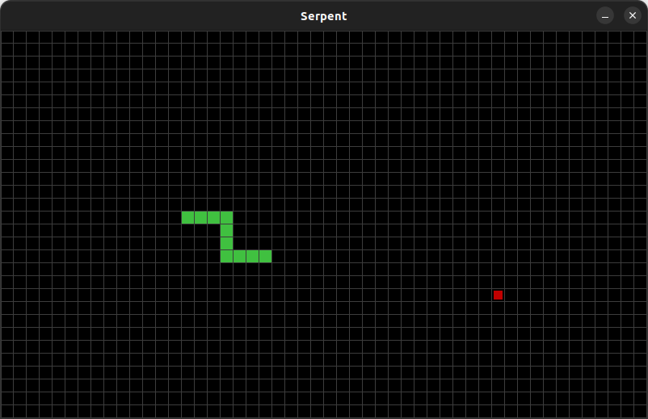

# MArcade - serpent

Serpent Márcio's Arcade games

Based on the fun Snake

## Screenshot



<!-- ## Videos

Watch on [YouTube]. -->

## Running

To start game:

``` bash
./marcade.py serpent
```

## Contributors

### Developers

- [Márcio Pessoa](https://github.com/marcio-pessoa)

### Designers

- [Márcio Pessoa](https://github.com/marcio-pessoa)

### Beta testers

- [Nícolas Masaishi Oi Pessoa](https://github.com/masaishi-pessoa)

## Contributing

Changes and improvements are more than welcome! Feel free to fork and open a pull request. Please make your changes in a specific branch and request to pull into `main`! If you can, please make sure the game fully works before sending the PR, as that will help speed up the process.

## License

Licensed under the [GPLv2](LICENSE).

## Donations

I made this in my spare time, and it's hosted on GitHub (which means I don't have any hosting costs), but if you enjoyed the game and feel like buying me coffee, you can donate at my PayPal: <marcio.pessoa@gmail.com>. Thank you very much!

---
<!-- [YouTube]: https://youtu.be/T_esCvHf8K4 -->
