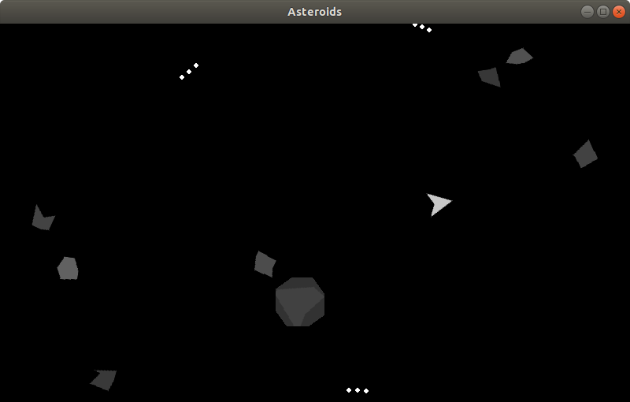

# MArcade

Márcio's Arcade games

## Changes

All notable changes to this project will be documented in this [Change log](CHANGELOG.yaml).

## Installing

### Cloning

``` sh
git clone https://github.com/marcio-pessoa/marcade.git
```

### Installing SO dependencies

``` sh
sudo apt install portaudio19-dev python3-all-dev
```

### Installing required Python modules

``` sh
cd marcade

pip3 install -r requirements.txt
```

## Usage

To start a random game:

``` sh
./marcade.py
```

To start a game (ie: Invasion):

``` sh
./marcade.py invasion
```

For help:

``` sh
./marcade.py -h
```

## Games available

### Invasion

Based on memorable Space Invaders

[](Documents/invasion.md)

### Pongue

Based on classic Pong

[](Documents/pongue.md)

### Rocks

Based on amazing Asteroids

[](Documents/rocks.md)

### Serpent

Based on the fun Snake

[](Documents/serpent.md)

## Contributing

Changes and improvements are more than welcome! Feel free to fork and open a pull request. Please make your changes in a specific branch and request to pull into `main`! If you can, please make sure the game fully works before sending the PR, as that will help speed up the process.

## License

Licensed under the [GPLv2](LICENSE).

## Donations

I made this in my spare time, and it's hosted on GitHub (which means I don't have any hosting costs), but if you enjoyed the game and feel like buying me coffee, you can donate at my PayPal: <marcio.pessoa@gmail.com>. Thank you very much!
