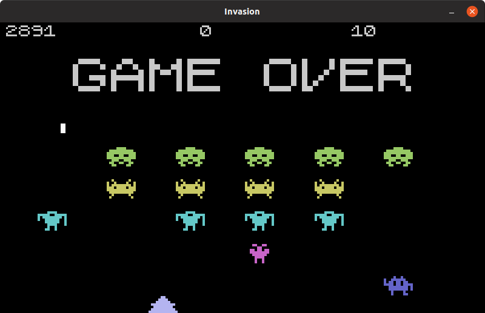
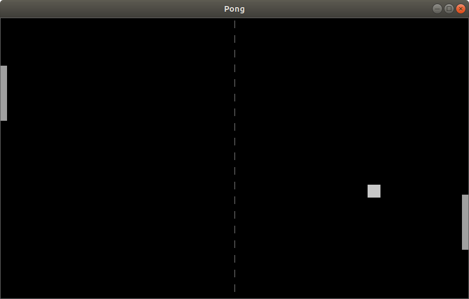
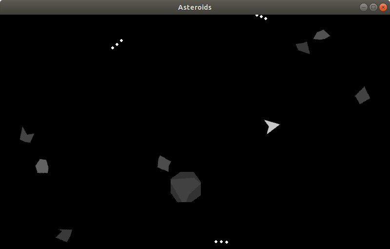
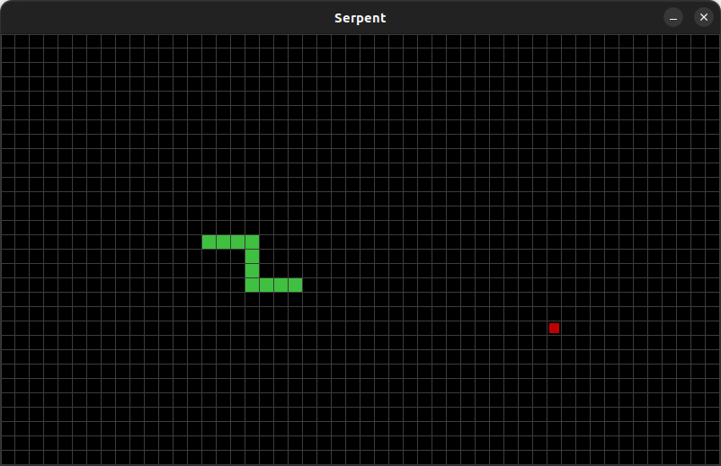
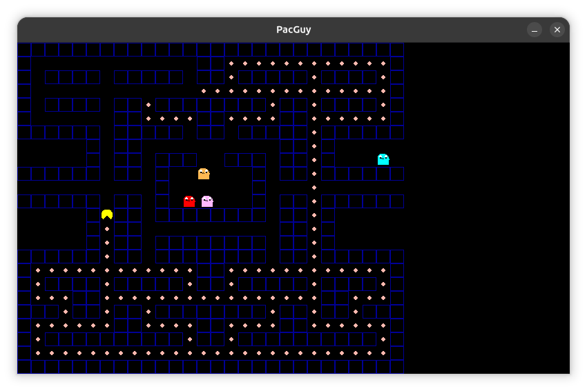

# MArcade

Márcio's Arcade games

## Changes

All notable changes to this project will be documented in this [Change log](CHANGELOG.yaml).

## Installing

### Cloning

``` sh
git clone https://github.com/marcio-pessoa/marcade.git
```

### Installing SO dependencies

On Ubuntu:

``` sh
sudo apt install portaudio19-dev python3-all-dev
```

On Mac:

``` sh
brew install portaudio
```

### Installing required Python modules

``` sh
cd marcade

pip3 install -r requirements.txt
```

## Usage

To start a random game:

``` sh
./marcade.py
```

To start a game (ie: Invasion):

``` sh
./marcade.py invasion
```

For help:

``` sh
./marcade.py -h
```

## Games available

### Invasion

Based on memorable Space Invaders

[](Documents/invasion.md)

### Pongue

Based on classic Pong

[](Documents/pongue.md)

### Rocks

Based on amazing Asteroids

[](Documents/rocks.md)

### Serpent

Based on the fun Snake

[](Documents/serpent.md)

### 2048

Based on the addictive 2048

[](Documents/2048.md)

### Pac-Guy

Based on classic Pac-Man

[](Documents/pacguy.md)

## Contributing

Changes and improvements are more than welcome! Feel free to fork and open a pull request. Please make your changes in a specific branch and request to pull into `main`! If you can, please make sure the game fully works before sending the Pull Request, as that will help speed up the process.


Make sure your contribution meets the [Functionality and Code Quality Criteria](#functionality-and-code-quality-criteria).

1. Fork the Project
2. Create your Feature Branch (`git checkout -b feature/AmazingFeature`)
3. Commit your Changes (`git commit -m 'Add some AmazingFeature'`)
4. Push to the Branch (`git push origin feature/AmazingFeature`)
5. Open a Pull Request

## Functionality and Code Quality Criteria

Make sure every development contribution meets the following functionality and code quality criteria.

To ensure code quality, this project uses `pre-commit` hooks. The hooks are defined in the `.pre-commit-config.yaml` file and are run automatically when you commit your changes.

### Installing pre-commit

To install the hooks, run the following command in the root of the repository:

```sh
pre-commit install
```

### Using pre-commit

Once installed, the hooks will be run automatically every time you commit your changes. If any of the hooks fail, the commit will be aborted. You can then fix the issues and try to commit again.

To run the hooks manually on all files, use the following command:

```sh
pre-commit run --all-files
```

## License

Licensed under the [GPLv2](LICENSE).

## Donations

I made this in my spare time, and it's hosted on GitHub, but if you enjoyed the game and feel like buying me coffee, you can donate at GitHub at [GitHub Sponsors](https://github.com/sponsors/marcio-pessoa) or my PayPal: <marcio.pessoa@gmail.com>. Thank you very much!
