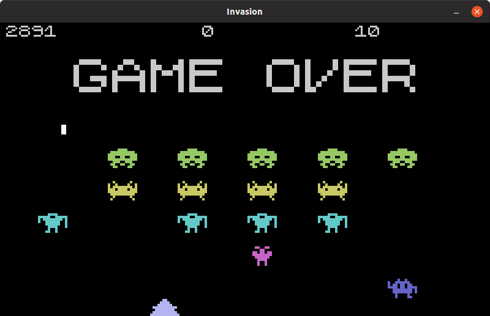
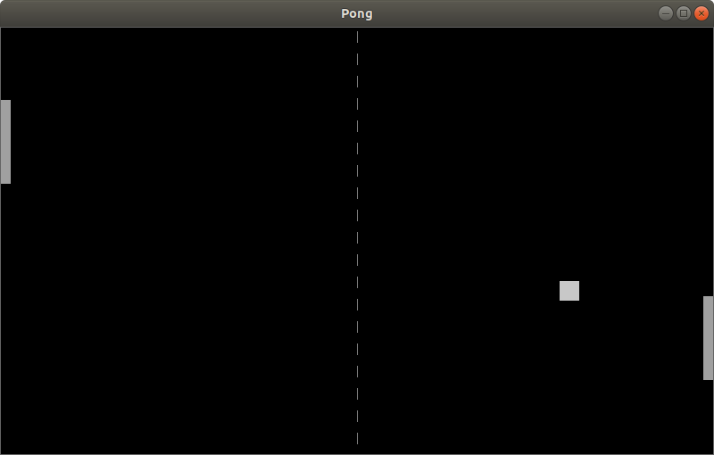

# MArcade
Márcio's Arcade games

## Changes
All notable changes to this project will be documented in this [Change log](CHANGELOG.md).

## Cloning
``` bash
git clone https://github.com/marcio-pessoa/marcade.git
```

### Installing required Python modules
``` bash
pip3 install -r requirements.txt
```

## Running
Enter MArcade directory:
``` bash
cd marcade
```

To start a random game:
``` bash
./marcade.py
```

To start a game:
``` bash
./marcade.py invasion
```

For help:
``` bash
./marcade.py -h
```

## Games available

### Rocks
Based on amazing Asteroids

[](Documents/rocks.md)

### Invasion
Based on memorable Space Invaders

[](Documents/invasion.md)

### Pongue
Based on classic Pong

[](Documents/pongue.md)

## Contributing
Changes and improvements are more than welcome! Feel free to fork and open a pull request. Please make your changes in a specific branch and request to pull into `master`! If you can, please make sure the game fully works before sending the PR, as that will help speed up the process.

## License
Licensed under the [GPLv2](LICENSE).

## Donations
I made this in my spare time, and it's hosted on GitHub (which means I don't have any hosting costs), but if you enjoyed the game and feel like buying me coffee, you can donate at my PayPal: marcio.pessoa@gmail.com. Thank you very much!
